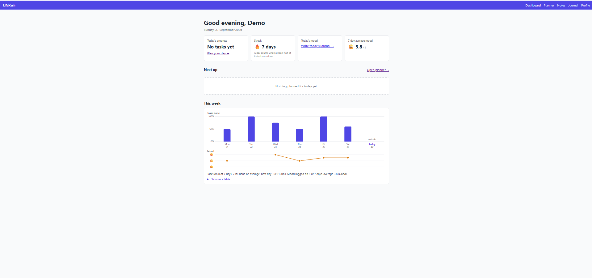
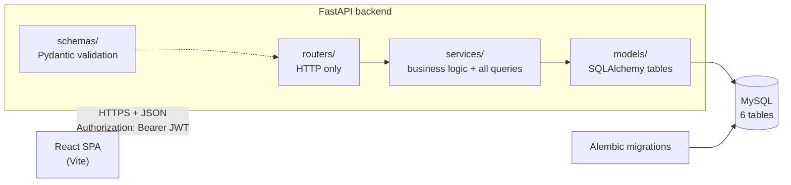
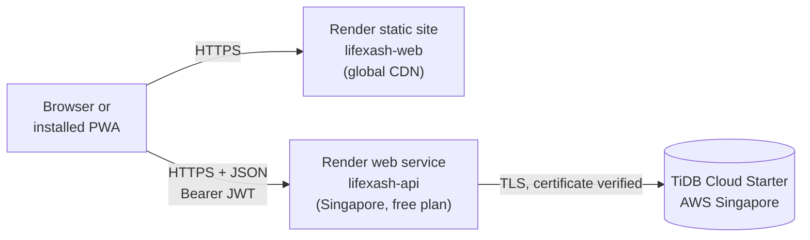

# LifeXash

**Live demo: <https://lifexash-web.onrender.com>.** Register with any email to try it; there is no
shared demo account. The API runs on Render's free plan and sleeps when nobody uses it, so **the first
request after a quiet period can take about a minute** while it wakes up. After that it's quick. It's a
portfolio project, so please don't store anything private in it.

LifeXash is a personal productivity web app that brings three daily habits into one place: a **daily
planner** for tasks, **notes** organised with tags, and a **mood journal**. A dashboard ties them together
with today's completion score, a streak of productive days and a 7-day mood trend. It's a full-stack
project (React, FastAPI and MySQL) that I designed, built and tested end to end: auth, a REST API with
per-user data isolation, database migrations and a React frontend. I built it with
[Claude Code](https://claude.com/claude-code) as my pair programmer. I made the design decisions, wrote
and ran the test plans, and debugged the issues they found (one of them is described below).



## Features

- **Accounts:** register, log in and log out with JWT auth. Every page and API route except login and
  register needs a valid token.
- **Daily planner:** add, edit, complete and delete tasks with a date, time and priority. The day view has
  a progress bar.
- **Notes and tags:** search by title and content, filter by tag, pin important notes, and create tags inline while
  editing.
- **Mood journal:** one entry per day with a 1–5 mood. A month calendar shows a mood emoji per day and the
  monthly average.
- **Dashboard:** a greeting, today's score (% of tasks done), the streak of days with at least half the
  tasks done, today's mood, the 7-day average mood, the next 3 tasks and a weekly chart.
- **Time zones:** dates are always the user's *local* day, and timestamps are stored in UTC, so
  "updated 2 hours ago" is correct wherever you are.
- **Mobile-friendly:** every page works on a 375 px phone screen. It has a bottom navigation bar, touch
  targets of at least 44 px, a full-screen task form and a compact 7-column journal calendar. The layout
  uses plain CSS media queries, with no UI library.
- **Installable (PWA):** it can be installed to the home screen or desktop, opens in its own window, shows
  a banner when you're offline, and asks you to reload when a new version is deployed.

## Tech stack

| Layer    | Technology |
|----------|------------|
| Frontend | React 19, Vite, React Router, Axios, vite-plugin-pwa (Workbox) |
| Backend  | FastAPI, Pydantic v2, SQLAlchemy 2.0, Alembic |
| Database | MySQL 9 locally, TiDB Cloud Starter (MySQL-compatible) in production |
| Hosting  | Render: static site (frontend) and web service (API, free plan, Singapore). Deployment in [`render.yaml`](render.yaml) |
| Auth     | JWT (PyJWT), bcrypt password hashing |
| Tests    | pytest (backend), Node's built-in test runner (`npm test`, frontend logic), plus manual test checklists (Swagger and browser) |

## Architecture



- **Layering:** routers only handle HTTP, services hold the logic and every DB query, and models are only
  table definitions.
- **User isolation:** every query filters by the logged-in user's id. Another user's record returns **404**,
  not 403, so the API never reveals that it exists.
- **Nothing derived is stored:** score and streak are calculated from tasks when requested.
- **The service worker caches only the app shell:** the service worker (the PWA's background script)
  stores the built HTML, JS, CSS and icons, so the app opens fast and even offline. It **never** caches
  API responses. They are private, so on a shared device the next person could see them, and a cached
  copy would go out of date. Offline, the app says that changes can't be saved instead of showing old data.
- **Config from the environment only:** the app refuses to start without `DATABASE_URL`, or if `JWT_SECRET`
  is missing or shorter than 32 characters.

### Production



- **Frontend:** the React build and service worker are a Render **static site**, served from a CDN. Unknown
  paths like `/notes/5` are rewritten to `index.html`, and `index.html`, `/` and `sw.js` are sent with
  `Cache-Control: no-cache`, so a new deploy reaches users.
- **API:** FastAPI runs as a Render **web service** in Singapore, next to the database. Each start runs
  `alembic upgrade head` before Uvicorn, and Render only switches to a new deploy after `/api/health`
  answers. On the free plan it sleeps after about 15 idle minutes, which causes the cold start mentioned at the top.
- **Database:** TiDB Cloud Starter (free, MySQL-compatible) in AWS Singapore. The API connects over TLS and
  verifies the server's certificate (see [Production database](#production-database-tidb-cloud-starter)).
- **Secrets** (`DATABASE_URL`, `JWT_SECRET`) are only in Render's environment settings, never in the repo.
- **Tested live:** the [deploy guide](docs/deploy-guide.md)'s live checks passed on 2026-09-27. On
  2026-09-28 the installed PWA passed on an Android phone (Chrome): install and icon, standalone start on
  the dashboard, phone layout, offline banner, and the "New version available · Reload" prompt after a real
  deploy. Cache Storage on the live site holds only the app shell, no API responses. It hasn't been tested
  on an iPhone yet.

## How I tested it

**Manual test checklists** (in [`docs/`](docs/)): each feature has a step-by-step checklist that I worked
through in Swagger and then in the browser. Each item lists the expected status code or on-screen result.
[Auth](docs/auth-test-checklist.md) · [Tasks](docs/tasks-test-checklist.md) ·
[Notes](docs/notes-test-checklist.md) · [Journal](docs/journal-test-checklist.md) ·
[Dashboard](docs/dashboard-test-checklist.md) · [Pre-deploy](docs/pre-deploy-checklist.md) ·
[Mobile + PWA](docs/mobile-pwa-test-checklist.md) ·
[TiDB Cloud](docs/tidb-test-checklist.md)

**User isolation (IDOR) tests:** with two accounts, User B tries to read, edit, toggle, pin and delete User
A's tasks, notes, tags and journal entries by guessing their ids. Every attempt must return **404**, the
same response as a record that doesn't exist. The tests also cover trickier cases, such as B attaching A's
tag to B's own note, or a mix of B's and A's tags (the whole request is rejected). In the browser, pasting
A's note URL while logged in as B shows "Note not found" and no data.
(IDOR = Insecure Direct Object Reference: accessing someone else's data by changing an id.)

**Time zone tests:** the app must use the user's local day, not UTC, which can be a different date for
part of the day. I used Chrome DevTools' Sensors panel to switch the browser to `Pacific/Kiritimati`
(UTC+14) and checked that the planner and journal open on the right local day. I also tested the
server's "no future dates" rule at both edges (before and after 05:30 IST, when UTC's date changes). Unit
tests check that timestamps leave the API in UTC with a `Z`.

**pytest unit tests** (`backend/tests/`, no database needed):
- the streak and score maths: rounding, the 50% rule (49.5% must not count), gaps, month and year
  boundaries, and "today isn't over yet"
- a regression test for the dashboard bug below
- timestamp serialisation (UTC with `Z`, dates left untouched)
- config validation (missing or short `JWT_SECRET`, comma-separated `CORS_ORIGINS`)

**A bug I found and fixed during testing:** the seed script creates predictable demo data (today 3 of 5
tasks done, a 7-day streak). The dashboard showed **1 of 5** and a streak of 0, and every day with any done
task showed exactly 1 done, even though the rows in the database were correct. I traced it to the query:
`func.sum(Task.is_completed)`. SQLAlchemy gives `SUM()` the type of its argument (Boolean), so MySQL's `3`
became `True`, and `int(True)` is `1`. The fix sums `case((Task.is_completed, 1), else_=0)` instead. I added
a regression test that fails on the old query. The existing streak tests couldn't catch this bug because
they receive the per-day counts ready-made. The full write-up is in the
[dashboard checklist](docs/dashboard-test-checklist.md#bug-found-during-testing).

## Run it locally

**Prerequisites:** Python 3.12+, Node.js 20+, and MySQL 9.x on `localhost:3306`.

### 1. Create the database

In MySQL Workbench or `mysql -u root -p`:

```sql
CREATE DATABASE lifexash CHARACTER SET utf8mb4 COLLATE utf8mb4_0900_ai_ci;
CREATE USER 'lifexash_user'@'localhost' IDENTIFIED BY 'choose_a_password';
GRANT ALL PRIVILEGES ON lifexash.* TO 'lifexash_user'@'localhost';
```

### 2. Backend (PowerShell)

```powershell
cd backend
python -m venv .venv
.\.venv\Scripts\Activate.ps1
pip install -r requirements-dev.txt
Copy-Item .env.example .env
python -c "import secrets; print(secrets.token_urlsafe(48))"   # paste as JWT_SECRET in .env
# also put your DB password in DATABASE_URL in .env
alembic upgrade head               # creates all tables
uvicorn app.main:app --reload      # http://localhost:8000
```

Check <http://localhost:8000/api/health>, which should return `{"status":"ok"}`. The interactive API docs
are at <http://localhost:8000/docs>. To run the unit tests, use `python -m pytest` from `backend/`.

Optional demo data for one user (registered in the app first):
`python -m scripts.seed_demo you@example.com --yes`

### 3. Frontend (second terminal)

```powershell
cd frontend
Copy-Item .env.example .env
npm install
npm run dev                        # http://localhost:5173
```

The service worker is only active in the production build. To try the installable app locally, run
`npm run build`, then `npm run preview` (http://localhost:4173, so add that URL to the backend's
`CORS_ORIGINS`). The icons in `frontend/public/` are drawn by `node scripts/make-icons.mjs`, which needs
no image library.

### Environment variables

| Variable | Where | Required | Meaning |
|----------|-------|----------|---------|
| `DATABASE_URL` | backend | yes | SQLAlchemy URL, e.g. `mysql+pymysql://user:pw@host:3306/lifexash?charset=utf8mb4`. Any host other than localhost gets verified TLS automatically |
| `JWT_SECRET` | backend | yes | Random string, at least 32 characters |
| `JWT_EXPIRE_MINUTES` | backend | no (60) | How long a login lasts |
| `CORS_ORIGINS` | backend | no (`http://localhost:5173`) | Comma-separated frontend URLs allowed to call the API |
| `VITE_API_URL` | frontend | yes, for `npm run build` | API base URL, baked into the bundle at build time |

### Database migrations

After changing a model in `backend/app/models/`:

```powershell
alembic revision --autogenerate -m "describe the change"
# review the new file in alembic/versions/, then:
alembic upgrade head
```

## Production database (TiDB Cloud Starter)

TiDB is a MySQL-compatible database. Its free Starter tier only accepts encrypted (TLS) connections.

**Connection:** the backend turns on TLS for every database host that isn't `localhost`, `127.0.0.1` or
`::1`. The server's certificate must be signed by a CA in [certifi](https://pypi.org/project/certifi/)'s
bundle and issued for that host name, or the connection is refused. Local MySQL works as before.
`DATABASE_URL` looks like this (take the host and user prefix from TiDB Cloud's **Connect** dialog):

```
mysql+pymysql://<PREFIX>.<USER>:<PASSWORD>@gateway01.<REGION>.prod.aws.tidbcloud.com:4000/lifexash?charset=utf8mb4
```

URL-encode special characters in the password:
`python -c "from urllib.parse import quote_plus; print(quote_plus('the password'))"`.

**One-time setup** (TiDB Cloud SQL editor), before `alembic upgrade head`:

```sql
CREATE DATABASE lifexash CHARACTER SET utf8mb4 COLLATE utf8mb4_0900_ai_ci;
SET GLOBAL tidb_enable_check_constraint = ON;  -- otherwise TiDB silently drops CHECK (mood 1-5)
```

**Differences from MySQL:**
- **Tested on the TiDB cluster:** `ON DELETE CASCADE`, the UNIQUE keys (409 errors), utf8mb4 (emoji) and the
  table collation behave the same as on MySQL.
- **CHECK enforced on TiDB Starter** (with `tidb_enable_check_constraint = ON` before migrating): mood 6 is
  rejected with error 3819. Without that setting TiDB silently drops CHECK constraints. The API also
  validates mood 1–5.
- **From TiDB's documentation, not tested on the cluster:** ENUM and `ON UPDATE CURRENT_TIMESTAMP` behave the same.
- **Ids** are unique but not consecutive (TiDB hands out ids in batches), and nothing in the app
  depends on consecutive ids.
- **Idle connections** are closed when the cluster scales down, so the connection pool checks
  connections before use and replaces them after 5 minutes.

**Check a database:** `python -m scripts.verify_remote_db` checks whichever database `DATABASE_URL`
points at. It covers TLS, tables and migrations, the mood CHECK, ON DELETE CASCADE and utf8mb4. It uses
its own test user and removes it afterwards. Its last line names the database and says LOCAL or
REMOTE, so check that it really ran against the cloud. The full manual
plan is the [TiDB checklist](docs/tidb-test-checklist.md).

## Backups

The backup scripts are for a **local MySQL only**. They refuse to run when `DATABASE_URL` points
anywhere else. For TiDB Cloud, use its own backup and export features.

**Back up** (from `backend/`, venv active):

```powershell
python -m scripts.backup_db
```

This saves `%USERPROFILE%\Documents\LifeXash-backups\lifexash_YYYY-MM-DD_HHMM.sql`, which is outside the
project so it can never be committed. It checks that the file is complete and keeps the 10 newest backups.
The DB password is passed to mysqldump in a temporary option file, never on the command line.

**Check that a backup restores** (restores the newest backup into a throw-away `lifexash_restore_test`
database, compares the row counts of every table, then drops it. The real database is only read):

```powershell
python -m scripts.restore_test
```

This needs a one-time grant as root:
``GRANT ALL PRIVILEGES ON `lifexash_restore_test`.* TO 'your_db_user'@'localhost';``

**Restore for real.** This **replaces** the current data in `lifexash`, so stop the backend and make a
fresh backup first. PowerShell has no `<` redirect, so use mysql's `source` command:

```powershell
mysql --default-character-set=utf8mb4 -u your_db_user -p -e "source C:/Users/<you>/Documents/LifeXash-backups/lifexash_YYYY-MM-DD_HHMM.sql"
```

## Roadmap

The planned features are done. Optional ideas:

- Test the installed app on an iPhone (Safari).
- A "Try again" button when a request fails (e.g. while the free API is waking up).
- A read-only demo account, so visitors can look around without registering.
